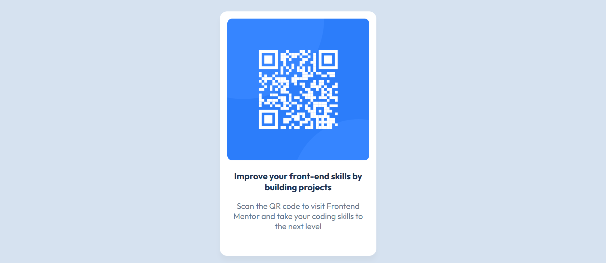

# Frontend Mentor - QR code component solution

This is a solution to the [QR code component challenge on Frontend Mentor](https://www.frontendmentor.io/challenges/qr-code-component-iux_sIO_H). Frontend Mentor challenges help you improve your coding skills by building realistic projects. 

## Table of contents

- [Overview](#overview)
  - [Screenshot](#screenshot)
  - [Links](#links)
- [My process](#my-process)
  - [Built with](#built-with)
  - [What I learned](#what-i-learned)
  - [Continued development](#continued-development)
  - [Useful resources](#useful-resources)
- [Author](#author)
- [Acknowledgments](#acknowledgments)

**Note: Delete this note and update the table of contents based on what sections you keep.**

## Overview

### Screenshot

### Links

- Solution URL: [https://www.frontendmentor.io/solutions/css-flexbox-media-query-PGQIMqj0P9](https://www.frontendmentor.io/solutions/css-flexbox-media-query-PGQIMqj0P9)

- Live Site URL: [https://avinashInnovator13.github.io/QR-code-page](https://avinashinnovator13.github.io/QR-code-page/)

## My process

### Built with

- Semantic HTML5 markup
- CSS custom properties
- Flexbox
- Desktop-first workflow

### What I learned

1. Before the project, I had never touched Git and GitHub so for the first time just because of this project I learned it and build a new skill in my skillset.

2. I also learned about **Media Query** in this project.

3. I learned how to write markdown

### Continued development

After this project, I would definitely like to work on the responsiveness of my project.

### Useful resources

- [Git and GitHub](https://youtu.be/Ez8F0nW6S-w?si=sndrXzvNZDZ6dKnU) - The course really helped me understand Concepts of Git and GitHub. If you know Hindi or Urdu langauge I would definitely recommend this course to you.

## Author

- Frontend Mentor - [@AvinashInnovator13](https://www.frontendmentor.io/profile/yourusername)

## Acknowledgments

I specially would like to say Thank you to the YouTube content creaters who create the valuable content and upload it for free which help tools of individuals like me.

